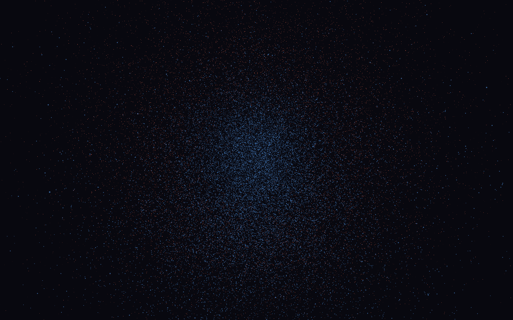
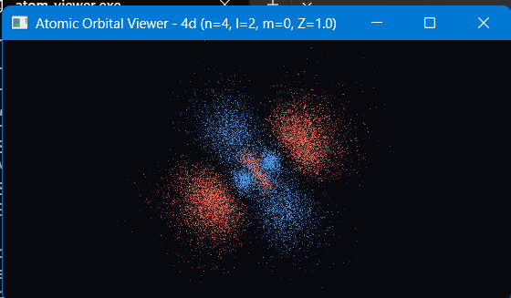

# Schrödinger Atom Structure Visualization
### *(Schrogineer _atom _struxture visiualization)*

[](https://en.wikipedia.org/wiki/C%2B%2B17)
[](https://www.opengl.org/)
[](https://cmake.org/)
[](https://vcpkg.io/)
[](https://github.com/)

An interactive, real-time 3D quantum mechanical simulation and visualization of hydrogen-like atomic orbitals. By directly solving the radial and angular components of the time-independent Schrödinger equation, this application samples electron probability density clouds $|\psi_{nlm}(\mathbf{r})|^2$ via 3D Monte Carlo rejection sampling and renders them with high-performance OpenGL point sprites.

---

## 📸 Visual Showcase & Screenshots

### Real-Time Electron Probability Density Cloud


*3D point-cloud representation of electron probability distribution $|\psi|^2$ rendered with additive blending and phase sign coloring.*

### 🌌 Orbital Gallery (Screenshot Showcase)

| **1s Ground State ($n=1, l=0, m=0$)** | **2p Subshell ($n=2, l=1, m=0$)** |
|:---:|:---:|
| <div align="center">*(Place your 1s orbital screenshot here)*<br>`screenshots/1s_orbital.png`</div> | <div align="center">*(Place your 2p orbital screenshot here)*<br>`screenshots/2p_orbital.png`</div> |

| **3d Orbital ($n=3, l=2, m=0$)** | **4f Complex Geometry ($n=4, l=3, m=0$)** |
|:---:|:---:|
| <div align="center">*(Place your 3d orbital screenshot here)*<br>`screenshots/3d_orbital.png`</div> | <div align="center">*(Place your 4f orbital screenshot here)*<br>`screenshots/4f_orbital.png`</div> |

> 💡 **Capturing Screenshots**: Press the runtime screenshot trigger in-app to export high-resolution frames directly to your project directory.

---

## ✨ Features

- **Exact Wavefunction Calculation**:
  - **Radial component $R_{nl}(r)$**: Solved via generalized Associated Laguerre polynomials $L_{n-l-1}^{2l+1}(\rho)$.
  - **Angular component $Y_{lm}(\theta, \phi)$**: Solved using Real Spherical Harmonics derived from Associated Legendre polynomials $P_l^{|m|}(x)$.
- **Monte Carlo Rejection Sampling**:
  - Samples hundreds of thousands of candidate spatial points inside a dynamic bounding volume.
  - Accepts points with probability proportional to the local density $|\psi_{nlm}(\mathbf{r})|^2$, creating physically accurate volumetric clouds.
- **Phase Sign Coloring**:
  - Distinguishes the quantum mechanical sign of $\psi(\mathbf{r})$:
    - 🔵 **Blue**: Positive phase lobe ($\psi > 0$)
    - 🔴 **Red**: Negative phase lobe ($\psi < 0$)
  - Highlights atomic nodal surfaces and interference planes identically to standard quantum chemistry diagrams.
- **Interactive Runtime Controls**:
  - Dynamically modify quantum numbers ($n, l, m$) and effective nuclear charge ($Z$) on the fly.
  - Automatic validation ensuring $0 \le l \le n - 1$ and $-l \le m \le l$.
- **Smooth Arcball Orbit Camera**:
  - Seamless 3D pitch/yaw rotation and smooth zooming to explore nodal surfaces from any perspective.
- **High Performance Additive Shading**:
  - Custom GLSL point sprite shaders with gaussian alpha falloff, producing luminous volumetric glows in regions of high probability density.

---

## 🔬 Mathematical & Theoretical Foundation

For a hydrogen-like single-electron system with nuclear charge $Z$, the spatial wavefunction in spherical coordinates $(r, \theta, \phi)$ is given by:

$$\psi_{nlm}(r, \theta, \phi) = R_{nl}(r) \, Y_{lm}(\theta, \phi)$$

### 1. Radial Wavefunction $R_{nl}(r)$
$$R_{nl}(r) = -\sqrt{\left(\frac{2Z}{n a_0}\right)^3 \frac{(n - l - 1)!}{2n [(n + l)!]^3}} e^{-\rho / 2} \rho^l L_{n - l - 1}^{2l + 1}(\rho)$$
where $\rho = \frac{2Zr}{n a_0}$ and $L_{n - l - 1}^{2l + 1}(\rho)$ are the Associated Laguerre polynomials.

### 2. Angular Wavefunction $Y_{lm}(\theta, \phi)$
Real linear combinations of spherical harmonics form the real-valued orbitals (such as $p_x, p_y, p_z, d_{z^2}, d_{xy}, \dots$):
$$Y_{lm}(\theta, \phi) = \begin{cases} \sqrt{2} (-1)^m \text{Im}[Y_l^{|m|}] & \text{if } m < 0 \\ Y_l^0 & \text{if } m = 0 \\ \sqrt{2} (-1)^m \text{Re}[Y_l^m] & \text{if } m > 0 \end{cases}$$

### 3. Probability Density & Rejection Sampling
The probability of finding the electron in an infinitesimal volume $d^3\mathbf{r}$ is:
$$P(\mathbf{r}) = |\psi_{nlm}(\mathbf{r})|^2$$
Random coordinate vectors $\mathbf{x} \sim U(V)$ are tested against the normalized probability envelope. Accepted points populate the GPU vertex buffers for real-time visualization.

---

## 🎮 Interactive Controls

| Input | Action |
|:---|:---|
| <kbd>↑</kbd> / <kbd>↓</kbd> | Increase / Decrease **$n$** (Principal Quantum Number) |
| <kbd>→</kbd> / <kbd>←</kbd> | Increase / Decrease **$l$** (Azimuthal / Angular Momentum: $s, p, d, f$) |
| <kbd>.</kbd> / <kbd>,</kbd> | Increase / Decrease **$m$** (Magnetic Quantum Number) |
| <kbd>=</kbd> / <kbd>-</kbd> | Increase / Decrease **$Z$** (Nuclear Charge / Hydrogen-like ions: $\text{H}, \text{He}^+, \text{Li}^{2+}$) |
| **Mouse Left Drag** | Orbit camera around the nucleus |
| **Mouse Scroll** | Zoom in / Zoom out |
| <kbd>Esc</kbd> | Exit application |

*Quantum numbers are clamped automatically to maintain physical constraints.*

---

## 🚀 Building & Running

### Windows (Visual Studio 2022 + vcpkg)

See **[WINDOWS_SETUP.md](WINDOWS_SETUP.md)** for a detailed walkthrough.

1. **Install Prerequisites**:
   - Visual Studio 2022 with **Desktop development with C++** and **C++ CMake tools for Windows**.
   - Install and bootstrap [vcpkg](https://github.com/microsoft/vcpkg), setting `VCPKG_ROOT`:
     ```powershell
     setx VCPKG_ROOT "C:\vcpkg"
     ```
2. **Open & Build in Visual Studio**:
   - Open Visual Studio 2022 → **File → Open → Folder...** → Select this repository folder.
   - VS will detect `CMakePresets.json` and automatically restore dependencies (`glfw3`, `glew`, `glm`) via `vcpkg.json`.
   - Select `atom_viewer.exe` as the startup target and press **F5** or **Ctrl+F5**.

3. **Command Line (Windows PowerShell)**:
   ```powershell
   cmake --preset windows-vcpkg
   cmake --build --preset windows-vcpkg
   .\build\windows-vcpkg\atom_viewer.exe
   ```

---

### Linux (Ubuntu / Debian)

1. **Install Dependencies**:
   ```bash
   sudo apt update
   sudo apt install -y build-essential cmake libglfw3-dev libglew-dev libglm-dev libgl1-mesa-dev
   ```

2. **Build and Run**:
   ```bash
   mkdir build && cd build
   cmake ..
   make -j$(nproc)
   ./atom_viewer
   ```

---

## 📂 Repository Structure

```text
├── CMakeLists.txt        # CMake build configuration
├── CMakePresets.json     # Windows MSVC + vcpkg configure presets
├── vcpkg.json            # Manifest file for GLFW3, GLEW, and GLM
├── README.md             # Project documentation & visual showcase
├── WINDOWS_SETUP.md      # Detailed Visual Studio 2022 instructions
├── orbital_preview.png   # High-resolution orbital cloud render
├── shaders/              # GLSL shaders (particle point sprites)
│   ├── point.vert        # Vertex shader (coordinate projection & size)
│   └── point.frag        # Fragment shader (circular sprite & phase glow)
└── src/                  # C++17 Core implementation
    ├── main.cpp          # Application lifecycle, GLFW loop & inputs
    ├── Wavefunction.h    # Quantum mathematics (Laguerre & Legendre polynomials)
    ├── Wavefunction.cpp  # Implementation of R_nl and Y_lm
    ├── OrbitalCloud.h    # Monte Carlo rejection sampler & GPU buffers
    ├── OrbitalCloud.cpp  # Point generation & phase classification
    ├── Camera.h          # 3D Arcball orbital camera
    ├── Camera.cpp        # Camera transformation matrices
    ├── Shader.h          # OpenGL shader compiler & linker
    └── Shader.cpp        # Shader loader utilities
```

---

## 📄 License

This project is open source and available under the [MIT License](LICENSE).
